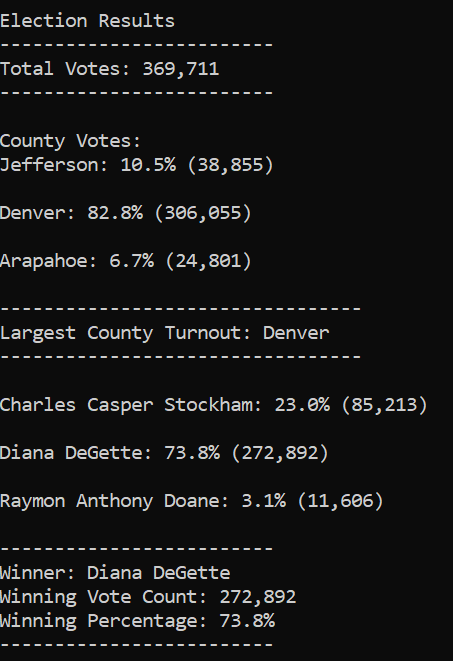

# Election Audit Analysis
Data analysis in an election audit of the tabulated results for the U.S. congressional precinct in colorado.

## Overview of Project 
### Purpose 
Seth and Tom needed extra help with the election audit, they needed a deep analysis of the data collected by mail-ballots, punch cards and direct recording electronic or DRE counting machines. This analysis was precise to report the total number of votes cast, the total votes for each candidate, the percetange of votes for each candidate, the winner of the election based on the popular votes, the voter turnout for each county, the percentage of votes from each county out of the total count and the county with the highest turnout.

## Results 
-How many votes were cast in this congressional election?
-----------------------------
The total votes were 369,711
_____________________________________________________________________________________________________________
  Initialize a total vote counter.
  total_votes = 0
  
    For each row in the CSV file.
     for row in reader:

        Add to the total vote count
        total_votes = total_votes + 1

-Provide a breakdown of the number of votes and the percentage of total votes for each county in the precinct.
-----------------------------
County Votes:
___________________________________________________________________________________________________________
Jefferson: 10.5% (38,855)

Denver: 82.8% (306,055)

Arapahoe: 6.7% (24,801)
_____________________________________________________________________________________________________________
    For each row in the CSV file.
    for row in reader:
      Extract the county name from each row.
        county_name = row[1]
        
        Write an if statement that checks that the county does not match any existing county in the county list.
        if county_name not in county_list:

            Add the existing county to the list of counties.
            county_list.append(county_name)

            Begin tracking the county's vote count.
            county_votes_dict[county_name] = 0

        Add a vote to that county's vote count.
        county_votes_dict[county_name] += 1

-Which county had the largest number of votes?
-----------------------------
Largest County Turnout: Denver
___________________________________________________________________________________________________________
  Track the largest county and county voter turnout.
  largest_county = ""
  county_voter = 0
    Write a for loop to get the county from the county dictionary.
    for county_name in county_votes_dict:
        Write an if statement to determine the winning county and get its vote count.
        if (county_votes >county_voter):
             county_voter = county_votes
             largest_county = county_name

-Provide a breakdown of the number of votes and the percentage of the total votes each candidate received.
-----------------------------
Charles Casper Stockham: 23.0% (85,213)

Diana DeGette: 73.8% (272,892)

Raymon Anthony Doane: 3.1% (11,606)
___________________________________________________________________________________________________________

  Candidate Options and candidate votes.
  candidate_options = []
  candidate_votes = {}
        Get the candidate name from each row.
        candidate_name = row[2]
         If the candidate does not match any existing candidate add it to the candidate list
        if candidate_name not in candidate_options:

            Add the candidate name to the candidate list.
            candidate_options.append(candidate_name)

            And begin tracking that candidate's voter count.
            candidate_votes[candidate_name] = 0

        Add a vote to that candidate's count
        candidate_votes[candidate_name] += 1
        
-Which candidate won the election, what was their vote count, and what was their percentage of the total votes?
-----------------------------
Winner: Diana DeGette
Winning Vote Count: 272,892
Winning Percentage: 73.8%
___________________________________________________________________________________________________________
#Track the winning candidate, vote count and percentage
  winning_candidate = ""
  winning_count = 0
  winning_percentage = 0
    for candidate_name in candidate_votes:

        Retrieve vote count and percentage
        votes = candidate_votes.get(candidate_name)
        vote_percentage = float(votes) / float(total_votes) * 100
        candidate_results = (
            f"{candidate_name}: {vote_percentage:.1f}% ({votes:,})\n")

        Determine winning vote count, winning percentage, and candidate.
        if (votes > winning_count) and (vote_percentage > winning_percentage):
            winning_count = votes
            winning_candidate = candidate_name
            winning_percentage = vote_percentage
            

### Summary
The script used for this analysis is very helpful for other elections audit, having the data in order files is neccessary to upload the code with the name and ubication of new data, the reader of cvs, the file_to_load and also the file_to_save. Also is possible to change the statement to determine the winning county or candidate to use the different information that each file has.
